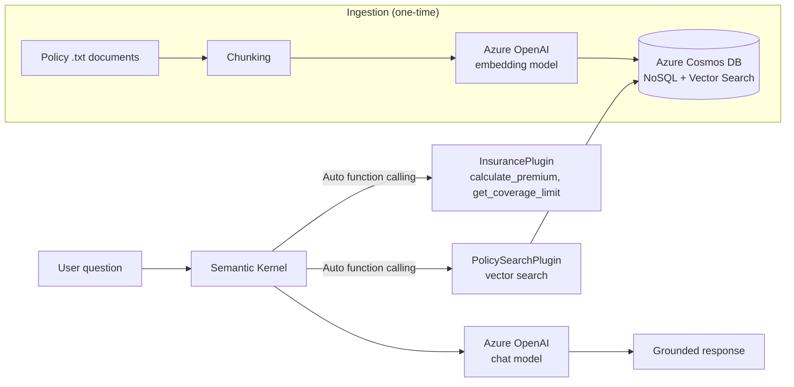

# Insurance Policy Assistant — RAG-Powered Console App

A C#/.NET console assistant for home insurance policyholders. It combines Azure OpenAI,
Semantic Kernel, and Azure Cosmos DB vector search to answer questions grounded in real
policy documents, alongside simple calculation and lookup tools — built as a hands-on
project to learn Azure AI integration end to end.

## What it does

Ask it a question about your policy — a premium calculation, a coverage limit, or a
specific clause from your policy documents — and it picks the right tool for the job
automatically:

```
You: I have a premium policy on a $450,000 home with a 0.6% rate — what's my premium,
     and does it fall under my coverage limit?
AI: Your annual premium would be $2,700. Since your home's insured value of $450,000
     is well under your premium policy's $1,000,000 coverage limit, you're fully covered.

You: If my house has emergency damage, how much can I authorize in repairs before
     the adjuster arrives?
AI: You can authorize up to $2,000 in emergency repairs before the adjuster's visit,
     as long as you keep all receipts and document the damage with photos beforehand.
```

The first answer comes from a calculation function. The second comes from a document
the assistant retrieved and read — neither answer is guessed from general knowledge.

## Architecture



**Flow:**
1. Policy documents are chunked and embedded once via an ingestion pipeline, then stored
   in Cosmos DB alongside their vector embeddings.
2. At chat time, the user's question goes to a Semantic Kernel `Kernel` configured with
   `FunctionChoiceBehavior.Auto()`.
3. The model decides which registered function(s) — if any — the question needs:
   a calculation, a fixed lookup, or a document search.
4. For document questions, `PolicySearchPlugin` embeds the query, runs a vector
   similarity search against Cosmos DB, and returns the closest matching chunks.
5. The model composes a final answer grounded in whatever was retrieved or computed.

## Tech stack

- **.NET / C#** — application language
- **Azure OpenAI Service** — chat completions (GPT-4.1-mini) and embeddings (text-embedding-3-small)
- **Semantic Kernel** (`Microsoft.SemanticKernel`) — orchestration, plugins, automatic function calling
- **Azure Cosmos DB for NoSQL** — vector store for document chunks (serverless, vector search enabled)
- **CommunityToolkit.VectorData.CosmosNoSql** — Semantic Kernel's Cosmos DB vector store connector

## Setup

### Prerequisites
- An Azure subscription
- An Azure OpenAI resource with two model deployments: a chat model (e.g. `gpt-4.1-mini`)
  and an embedding model (`text-embedding-3-small`)
- An Azure Cosmos DB for NoSQL account with **Vector Search** enabled (Features →
  Vector Search for NoSQL API)

### Configuration
Secrets are stored via `dotnet user-secrets`, never committed to source control:

```bash
dotnet user-secrets set "AZURE_OPENAI_ENDPOINT" "https://YOUR-RESOURCE.openai.azure.com/"
dotnet user-secrets set "AZURE_OPENAI_GPT_NAME" "your-chat-deployment-name"
dotnet user-secrets set "AZURE_OPENAI_API_KEY" "your-api-key"
dotnet user-secrets set "AZURE_OPENAI_EMBEDDING_DEPLOYMENT" "your-embedding-deployment-name"
dotnet user-secrets set "COSMOS_DB_ENDPOINT" "your-cosmos-uri"
dotnet user-secrets set "COSMOS_DB_KEY" "your-cosmos-primary-key"
```

### Cosmos DB container
Create a database and container (`PolicyChunks`) with a vector policy matching
`PolicyChunk.cs`: path `/embedding`, 1536 dimensions, `float32`, cosine distance.

### Run it
```bash
dotnet restore

# First run only — populates the vector store from docs/*.txt
# Set runIngestion = true in Program.cs, then:
dotnet run

# Set runIngestion back to false, then for normal use:
dotnet run
```

## Project structure

```
├── Program.cs              # Orchestration, kernel setup, chat loop
├── PolicyChunk.cs           # Cosmos DB vector store data model
├── InsurancePlugin.cs       # Premium calculation + coverage lookup functions
├── PolicySearchPlugin.cs    # Vector search plugin over policy documents
├── docs/                    # Source policy documents (chunked and embedded at ingestion)
└── README.md
```

## Challenges and how they were solved

**Silent zero-result retrieval.** The retrieval plugin returned zero results despite
confirmed data in Cosmos DB. Root-caused to a mismatch between the C# `Embedding`
property's default PascalCase JSON serialization and the Cosmos container's vector
index path (`/embedding`, lowercase) — the vector index was silently searching a field
name that didn't match what was actually stored. Fixed by explicitly setting
`[JsonPropertyName]` on every model property to keep C#, `System.Text.Json`, and the
Cosmos vector policy consistent with each other.

**Missing query embedding step.** `VectorStoreTextSearch` initially failed because it
had no way to convert a user's natural-language question into a vector at query time —
ingestion-time embeddings were generated manually, but query-time embedding needed an
explicit `ITextEmbeddingGenerationService` passed into the constructor.

**Default result mapping didn't fit a custom data model.** Semantic Kernel's built-in
result mapper expects a conventional property shape and threw a null-value exception
against the project's `ChunkText`-based model. Solved with an explicit result mapper
(and eventually a dedicated `PolicySearchPlugin` class) that maps `PolicyChunk` fields
to `TextSearchResult` directly, giving full control over what the model receives.

**Experimental API surface.** Several Semantic Kernel vector store and text search APIs
are marked `SKEXP0001`/`SKEXP0010` (Microsoft's preview-feature warning system) and
required explicit acknowledgement via `#pragma warning disable` — expected for this part
of the SDK at its current maturity, not a sign of misuse.

## Possible extensions
- Real PDF ingestion (currently plain-text documents) via a PDF-parsing library
- Streaming responses instead of waiting for the full completion
- A lightweight web UI instead of console I/O
- Source citation in responses (which document/chunk an answer came from)
